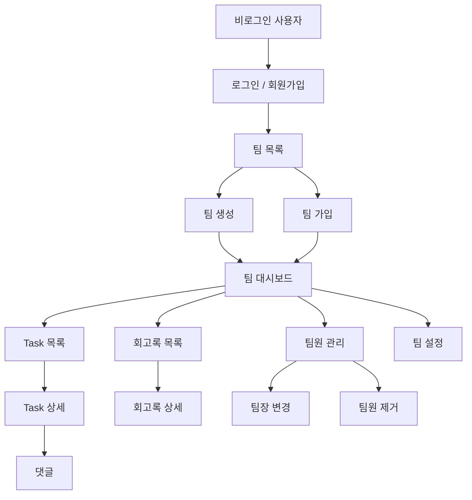
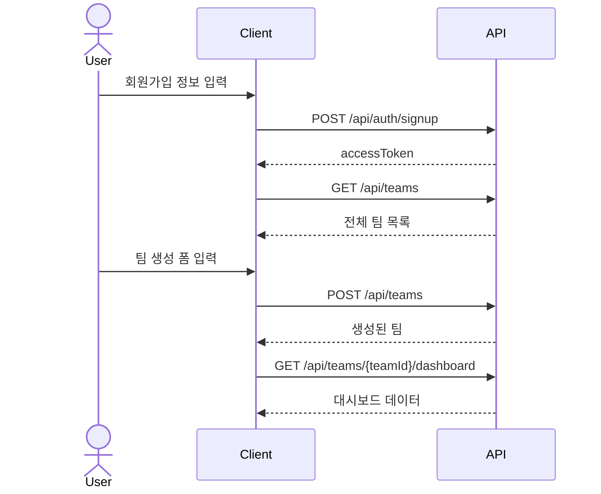
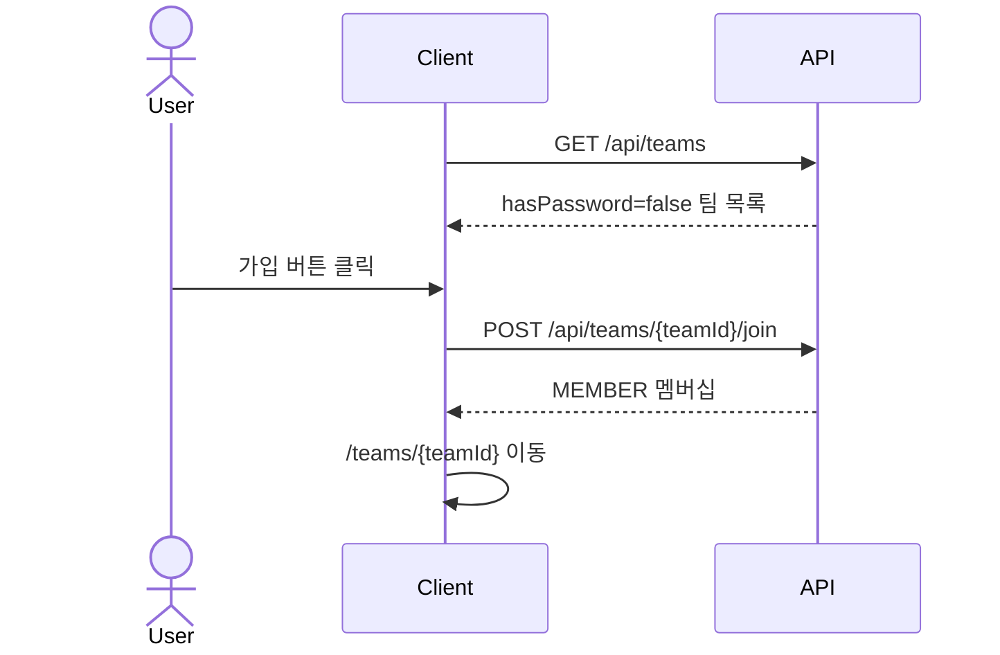
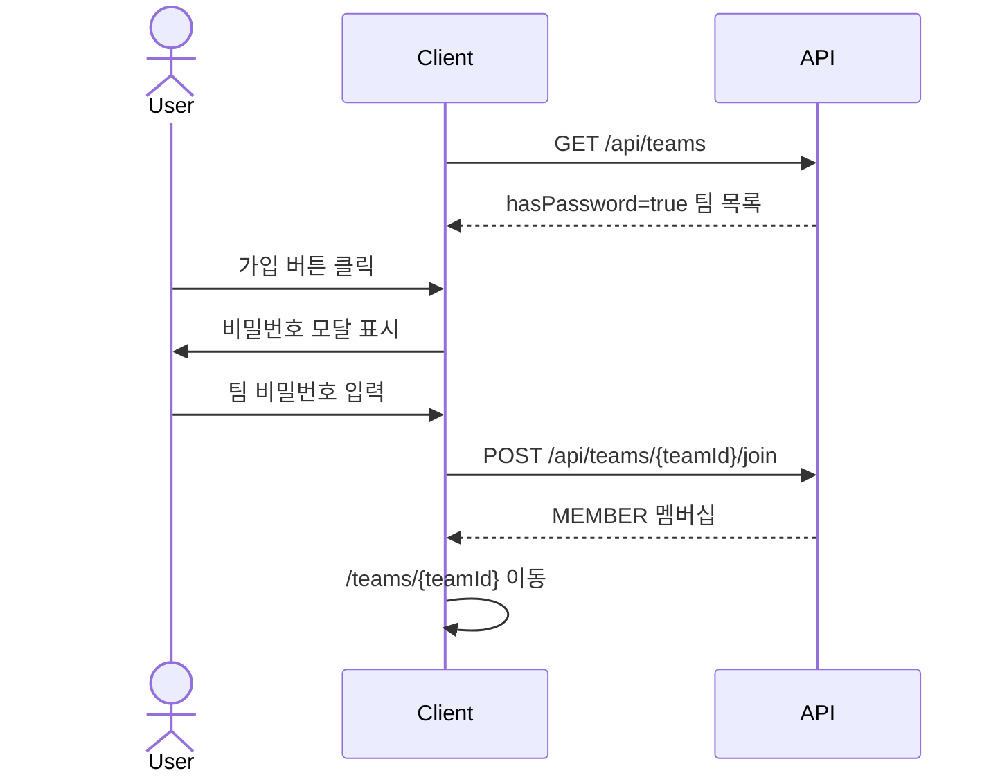
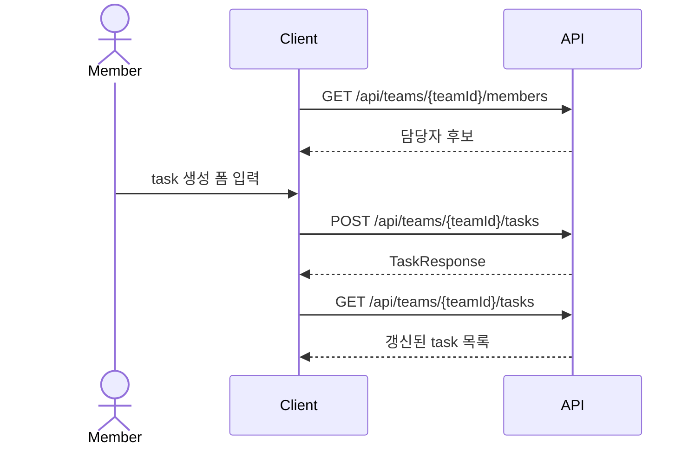
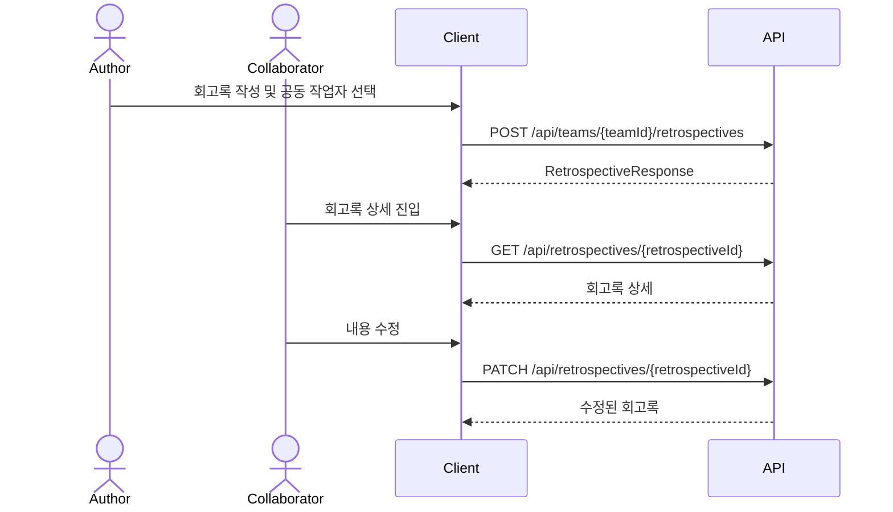

# Scrum Helper IA & Screen Spec

## 1. 문서 목적

이 문서는 `SPEC.md`, `DB_SCHEMA.md`, `API_SPEC.md`에서 확정된 MVP를 화면 구조와 사용자 흐름으로 변환한 문서다.

React 라우팅, 페이지 컴포넌트, 폼 구성, 버튼 동작, 빈 상태, 권한별 노출 정책은 이 문서를 기준으로 구현한다.

## 2. IA 요약



## 3. 라우트 구조

| Route | 화면 | 접근 권한 | 설명 |
|---|---|---|---|
| `/login` | 로그인 | 비로그인 | 이메일/비밀번호 로그인 |
| `/signup` | 회원가입 | 비로그인 | 이름/이메일/비밀번호 가입 |
| `/teams` | 팀 목록 | 로그인 | 전체 팀 목록, 팀 생성, 팀 가입 |
| `/teams/:teamId` | 팀 대시보드 | 팀원 | 팀 요약, task/회고 요약 |
| `/teams/:teamId/members` | 팀원 관리 | 팀원 | 팀원 목록, 팀장 기능 |
| `/teams/:teamId/settings` | 팀 설정 | 팀장 | 팀명/설명/비밀번호 변경 |
| `/teams/:teamId/tasks` | Task 목록 | 팀원 | task 목록, 필터, 생성 |
| `/teams/:teamId/tasks/:taskId` | Task 상세 | 팀원 | task 수정, 완료 변경, 댓글 |
| `/teams/:teamId/retrospectives` | 회고록 목록 | 팀원 | 회고록 목록, 생성 |
| `/teams/:teamId/retrospectives/:retrospectiveId` | 회고록 상세 | 팀원 | 회고록 조회/수정/삭제 |

라우팅 정책:

- 비로그인 사용자가 보호 라우트에 접근하면 `/login`으로 이동한다.
- 로그인 사용자가 `/login`, `/signup`에 접근하면 `/teams`로 이동한다.
- 팀원이 아닌 사용자가 팀 내부 라우트에 접근하면 `/teams`로 이동하고 에러 메시지를 표시한다.
- 팀 가입 또는 팀 생성 성공 후 `/teams/:teamId` 대시보드로 이동한다.

## 4. 공통 레이아웃

### 4.1 인증 전 레이아웃

사용 화면:

- `/login`
- `/signup`

구성:

- 좌측 또는 상단: 서비스명 `Scrum Helper`
- 중앙: 인증 폼
- 하단: 로그인/회원가입 전환 링크

### 4.2 인증 후 레이아웃

사용 화면:

- `/teams`
- `/teams/:teamId/*`

구성:

- 상단 바
  - 서비스명
  - 현재 사용자 이름
  - 로그아웃 버튼
- 메인 영역
  - 팀 목록 화면 또는 팀 내부 화면
- 팀 내부 화면 사이드 내비게이션
  - 대시보드
  - Task
  - 회고록
  - 팀원
  - 설정: 팀장만 노출

## 5. 화면 상세

## 5.1 로그인 화면

| 항목 | 내용 |
|---|---|
| Route | `/login` |
| 접근 권한 | 비로그인 |
| 주요 API | `POST /api/auth/login` |

### UI 구성

- 이메일 입력
- 비밀번호 입력
- 로그인 버튼
- 회원가입 이동 링크

### 사용자 흐름

1. 사용자가 이메일과 비밀번호를 입력한다.
2. 로그인 버튼을 누른다.
3. 성공하면 access token을 저장한다.
4. `/teams`로 이동한다.
5. 실패하면 폼 하단에 오류 메시지를 표시한다.

### 상태

| 상태 | 표시 |
|---|---|
| 로딩 | 로그인 버튼 disabled, `로그인 중...` |
| 오류 | `이메일 또는 비밀번호가 올바르지 않습니다.` |
| 비어 있는 값 | 필드 아래 validation 메시지 |

## 5.2 회원가입 화면

| 항목 | 내용 |
|---|---|
| Route | `/signup` |
| 접근 권한 | 비로그인 |
| 주요 API | `POST /api/auth/signup` |

### UI 구성

- 이름 입력
- 이메일 입력
- 비밀번호 입력
- 회원가입 버튼
- 로그인 이동 링크

### 사용자 흐름

1. 이름, 이메일, 비밀번호를 입력한다.
2. 회원가입 버튼을 누른다.
3. 성공하면 access token을 저장한다.
4. `/teams`로 이동한다.

### 상태

| 상태 | 표시 |
|---|---|
| 이메일 중복 | `이미 가입된 이메일입니다.` |
| 입력 오류 | 필드별 validation 메시지 |
| 로딩 | 회원가입 버튼 disabled |

## 5.3 팀 목록 화면

| 항목 | 내용 |
|---|---|
| Route | `/teams` |
| 접근 권한 | 로그인 |
| 주요 API | `GET /api/teams`, `POST /api/teams`, `POST /api/teams/{teamId}/join` |

### UI 구성

- 팀 검색 입력
- 팀 생성 버튼
- 전체 팀 목록
- 팀 카드
  - 팀 이름
  - 설명
  - 공개 팀/비밀번호 팀 표시
  - 팀장 이름
  - 팀원 수
  - 내 가입 여부
  - 가입 버튼 또는 입장 버튼

### 팀 카드 동작

| 조건 | 버튼 | 동작 |
|---|---|---|
| 이미 가입한 팀 | 입장 | `/teams/:teamId` 이동 |
| 공개 팀, 미가입 | 가입 | 즉시 가입 후 대시보드 이동 |
| 비밀번호 팀, 미가입 | 비밀번호 입력 | 비밀번호 모달 표시 |

### 팀 생성 모달

입력:

- 팀 이름
- 팀 설명
- 팀 비밀번호: optional

버튼:

- 생성
- 취소

정책:

- 팀 이름은 필수다.
- 팀 이름은 unique하다.
- 비밀번호가 비어 있으면 공개 팀으로 생성한다.
- 생성자는 팀장이 된다.

### 상태

| 상태 | 표시 |
|---|---|
| 팀 없음 | `아직 생성된 팀이 없습니다.`와 팀 생성 버튼 |
| 검색 결과 없음 | `검색 결과가 없습니다.` |
| 팀 이름 중복 | 팀 생성 모달에 오류 표시 |
| 팀 비밀번호 오류 | 비밀번호 모달에 오류 표시 |

## 5.4 팀 대시보드 화면

| 항목 | 내용 |
|---|---|
| Route | `/teams/:teamId` |
| 접근 권한 | 팀원 |
| 주요 API | `GET /api/teams/:teamId`, `GET /api/teams/:teamId/dashboard`, `GET /api/teams/:teamId/members` |

### UI 구성

- 팀 이름
- 팀 설명
- 팀장 이름
- 팀원 수
- task 요약
  - 전체 task
  - 완료 task
  - 미완료 task
  - 마감 초과 task
  - 마감 임박 task
- 회고록 요약
  - 전체 회고록
  - 내가 작성한 회고록
  - 내가 공동 작업자인 회고록
- 빠른 이동 버튼
  - Task 보기
  - 회고록 보기
  - 팀원 보기

### 상태

| 상태 | 표시 |
|---|---|
| task 없음 | `아직 등록된 task가 없습니다.` |
| 회고록 없음 | `아직 작성된 회고록이 없습니다.` |
| 권한 없음 | `/teams`로 이동 후 메시지 표시 |

## 5.5 팀원 관리 화면

| 항목 | 내용 |
|---|---|
| Route | `/teams/:teamId/members` |
| 접근 권한 | 팀원 |
| 주요 API | `GET /api/teams/:teamId/members`, `DELETE /api/teams/:teamId/members/:memberId`, `PATCH /api/teams/:teamId/leader` |

### UI 구성

- 팀원 목록
  - 이름
  - 이메일
  - 역할: `LEADER`, `MEMBER`
  - 가입일
- 팀장 전용 버튼
  - 팀장 변경
  - 팀원 제거

### 권한별 노출

| 사용자 | 노출 |
|---|---|
| 팀장 | 팀장 변경 버튼, 팀원 제거 버튼 |
| 일반 팀원 | 팀원 목록만 표시 |

### 팀장 변경 흐름

1. 팀장이 새 팀장으로 지정할 팀원을 선택한다.
2. 확인 모달을 표시한다.
3. 확인 시 `PATCH /api/teams/:teamId/leader`를 호출한다.
4. 성공하면 현재 팀장은 `MEMBER`, 새 팀장은 `LEADER`로 표시된다.

확인 메시지:

```text
팀장을 김민준님으로 변경할까요? 변경 후 현재 팀장은 일반 팀원이 됩니다.
```

### 팀원 제거 흐름

1. 팀장이 제거할 팀원을 선택한다.
2. 확인 모달을 표시한다.
3. 확인 시 `DELETE /api/teams/:teamId/members/:memberId`를 호출한다.
4. 성공하면 팀원 목록에서 제거된다.

예외:

- 제거 대상이 task의 유일 담당자면 제거 실패
- 제거 전에 task 담당자를 재배정해야 한다.

## 5.6 팀 설정 화면

| 항목 | 내용 |
|---|---|
| Route | `/teams/:teamId/settings` |
| 접근 권한 | 팀장 |
| 주요 API | `PATCH /api/teams/:teamId`, `PATCH /api/teams/:teamId/password` |

### UI 구성

- 팀 이름 입력
- 팀 설명 입력
- 팀 비밀번호 변경 섹션
  - 새 비밀번호 입력
  - 공개 팀으로 변경 버튼
- 저장 버튼

### 정책

- 팀 설정은 팀장만 접근 가능하다.
- 팀 이름은 unique해야 한다.
- 비밀번호를 비우면 공개 팀이 된다.
- 비밀번호 해시는 서버에서만 저장하고 클라이언트에 노출하지 않는다.

## 5.7 Task 목록 화면

| 항목 | 내용 |
|---|---|
| Route | `/teams/:teamId/tasks` |
| 접근 권한 | 팀원 |
| 주요 API | `GET /api/teams/:teamId/tasks`, `POST /api/teams/:teamId/tasks` |

### UI 구성

- 필터 바
  - 완료 여부: 전체/미완료/완료
  - 중요도: 전체/낮음/보통/높음
  - 담당자
  - 마감일 범위
- task 생성 버튼
- task 목록
- task 카드
  - 제목
  - 중요도
  - 마감일
  - 완료 여부
  - 담당자 이름 목록
  - 댓글 수

### Task 생성 모달

입력:

- 제목: required
- 설명: optional
- 중요도: `LOW`, `MEDIUM`, `HIGH`
- 마감일: required
- 담당자: 1명 이상 required

버튼:

- 생성
- 취소

### 목록 구분

MVP에서는 task 상태가 완료/미완료뿐이다. 화면은 아래 두 섹션으로 구성한다.

- 미완료
- 완료

### 상태

| 상태 | 표시 |
|---|---|
| task 없음 | `아직 등록된 task가 없습니다.` |
| 담당자 미선택 | `담당자를 1명 이상 선택하세요.` |
| 마감 초과 | 카드에 `마감 초과` 표시 |
| 마감 임박 | 카드에 `마감 임박` 표시 |

## 5.8 Task 상세 화면

| 항목 | 내용 |
|---|---|
| Route | `/teams/:teamId/tasks/:taskId` |
| 접근 권한 | 팀원 |
| 주요 API | `GET /api/tasks/:taskId`, `PATCH /api/tasks/:taskId`, `PATCH /api/tasks/:taskId/completion`, `DELETE /api/tasks/:taskId`, `GET /api/tasks/:taskId/comments`, `POST /api/tasks/:taskId/comments` |

### UI 구성

- task 제목
- 설명
- 중요도
- 마감일
- 완료 여부 토글
- 담당자 선택
- 저장 버튼
- 삭제 버튼
- 댓글 목록
- 댓글 입력

### 수정 정책

- 팀원 모두 task를 수정할 수 있다.
- 담당자는 1명 이상이어야 한다.
- task 삭제도 팀원 모두 가능하다.

### 댓글 정책

- 팀원은 댓글을 작성할 수 있다.
- 댓글 수정/삭제는 작성자만 가능하다.
- 팀장도 타인의 댓글을 수정/삭제할 수 없다.

## 5.9 회고록 목록 화면

| 항목 | 내용 |
|---|---|
| Route | `/teams/:teamId/retrospectives` |
| 접근 권한 | 팀원 |
| 주요 API | `GET /api/teams/:teamId/retrospectives`, `POST /api/teams/:teamId/retrospectives` |

### UI 구성

- 회고록 생성 버튼
- 작성자 필터
- 공동 작업자 필터
- 회고록 목록
- 회고록 카드
  - 제목
  - 작성자
  - 공동 작업자
  - 최근 수정일

### 회고록 생성 모달

입력:

- 제목: required
- 어제 한 일
- 오늘 할 일
- 궁금한/필요한/알아낸 것
- 공동 작업자: optional

정책:

- 작성자는 현재 로그인 사용자다.
- 공동 작업자는 같은 팀원만 선택할 수 있다.
- 작성자는 공동 작업자에 포함할 수 없다.

## 5.10 회고록 상세 화면

| 항목 | 내용 |
|---|---|
| Route | `/teams/:teamId/retrospectives/:retrospectiveId` |
| 접근 권한 | 팀원 |
| 주요 API | `GET /api/retrospectives/:retrospectiveId`, `PATCH /api/retrospectives/:retrospectiveId`, `DELETE /api/retrospectives/:retrospectiveId` |

### UI 구성

- 제목
- 작성자
- 공동 작업자
- 어제 한 일
- 오늘 할 일
- 궁금한/필요한/알아낸 것
- 수정 버튼
- 삭제 버튼

### 권한별 동작

| 사용자 | 읽기 | 수정 | 삭제 | 공동 작업자 변경 |
|---|---:|---:|---:|---:|
| 팀원 | Y | N | N | N |
| 작성자 | Y | Y | Y | Y |
| 공동 작업자 | Y | Y | Y | Y |
| 팀장 | Y | 작성자/공동 작업자인 경우만 | 작성자/공동 작업자인 경우만 | 작성자/공동 작업자인 경우만 |

정책:

- 팀장은 팀장이라는 이유만으로 타인의 회고록을 수정/삭제할 수 없다.
- 작성자와 공동 작업자는 공동 작업자 목록을 변경할 수 있다.
- 작성자는 공동 작업자 목록에 포함하지 않는다.

## 6. 주요 사용자 플로우

### 6.1 첫 사용자가 팀을 만드는 흐름



### 6.2 공개 팀 가입 흐름



### 6.3 비밀번호 팀 가입 흐름



### 6.4 task 생성 흐름



### 6.5 회고록 협업 흐름



## 7. 공통 UI 상태

| 상태 | 처리 |
|---|---|
| 페이지 로딩 | 화면 본문에 skeleton 또는 로딩 텍스트 |
| 목록 비어 있음 | 빈 상태 문구와 주요 생성 버튼 |
| API 오류 | 화면 상단 또는 폼 하단에 오류 메시지 |
| 저장 중 | 저장 버튼 disabled |
| 삭제 | 확인 모달 후 실행 |
| 권한 없음 | 이전 안전 화면으로 이동 후 메시지 |
| 로그인 만료 | token 삭제 후 `/login` 이동 |

## 8. 컴포넌트 구조 초안

```text
src/
  app/
    App.tsx
    router.tsx
  api/
    client.ts
    authApi.ts
    teamApi.ts
    taskApi.ts
    retrospectiveApi.ts
  components/
    layout/
      AuthLayout.tsx
      AppLayout.tsx
      TeamLayout.tsx
    common/
      Button.tsx
      Modal.tsx
      EmptyState.tsx
      ErrorMessage.tsx
      LoadingState.tsx
  pages/
    auth/
      LoginPage.tsx
      SignupPage.tsx
    teams/
      TeamListPage.tsx
      TeamDashboardPage.tsx
      TeamMembersPage.tsx
      TeamSettingsPage.tsx
    tasks/
      TaskListPage.tsx
      TaskDetailPage.tsx
    retrospectives/
      RetrospectiveListPage.tsx
      RetrospectiveDetailPage.tsx
```

## 9. 구현 우선순위

| 순서 | 화면 | 이유 |
|---:|---|---|
| 1 | 로그인/회원가입 | 모든 보호 화면의 전제 |
| 2 | 팀 목록/팀 생성/팀 가입 | 서비스 진입 핵심 |
| 3 | 팀 대시보드 | 가입 후 기본 화면 |
| 4 | 팀원 관리 | 담당자/공동 작업자 선택의 기반 |
| 5 | Task 목록/상세 | 핵심 사용 기능 |
| 6 | 댓글 | task 협업 기능 |
| 7 | 회고록 목록/상세 | 스크럼 일지 기능 |
| 8 | 팀 설정 | 팀장 전용 관리 기능 |

## 10. 다음 단계

이 문서를 기준으로 백엔드와 프론트엔드 상세 설계를 파생했다.

1. `BACKEND_DESIGN.md`: Spring Boot 패키지, Entity, Service 설계
2. `FRONTEND_DESIGN.md`: React route, component, state, API client 설계
3. 다음 작업은 `backend/`, `frontend/` 프로젝트 생성이다.
