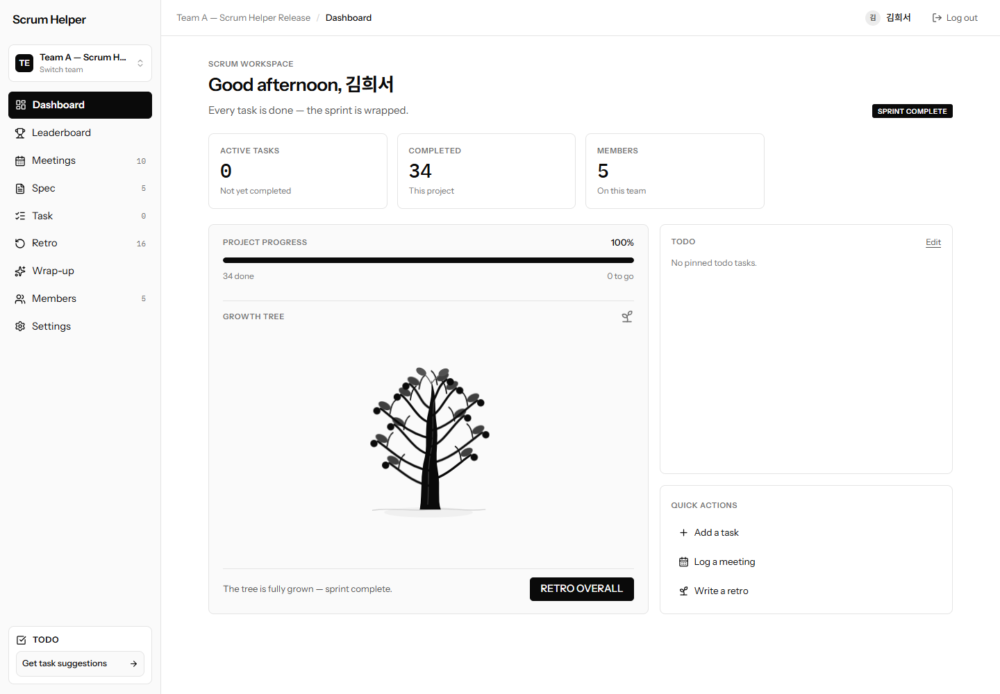
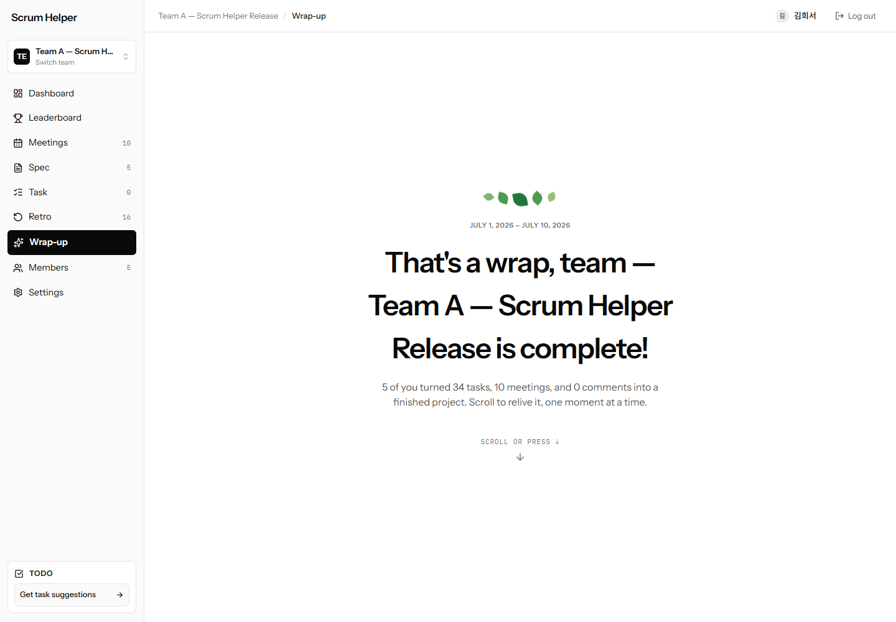
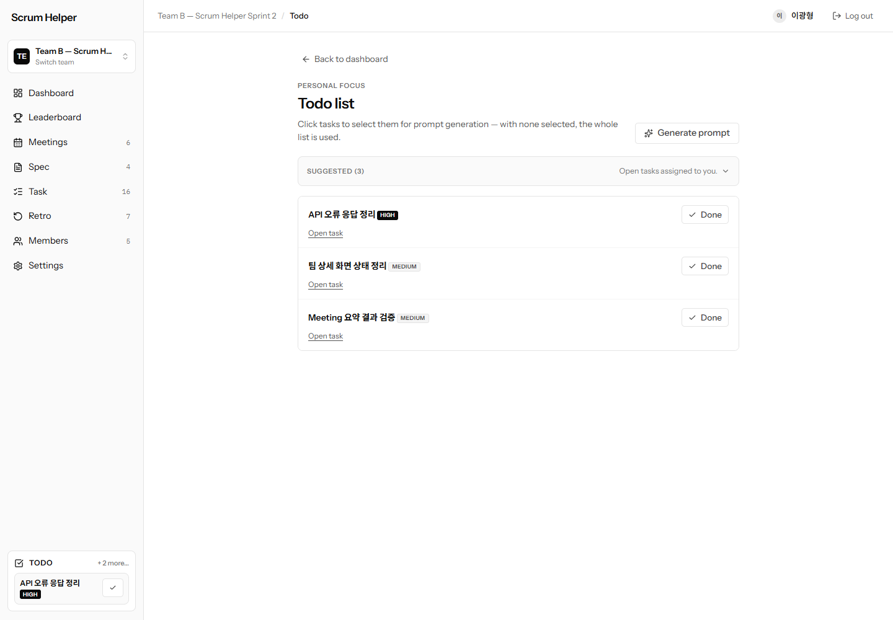
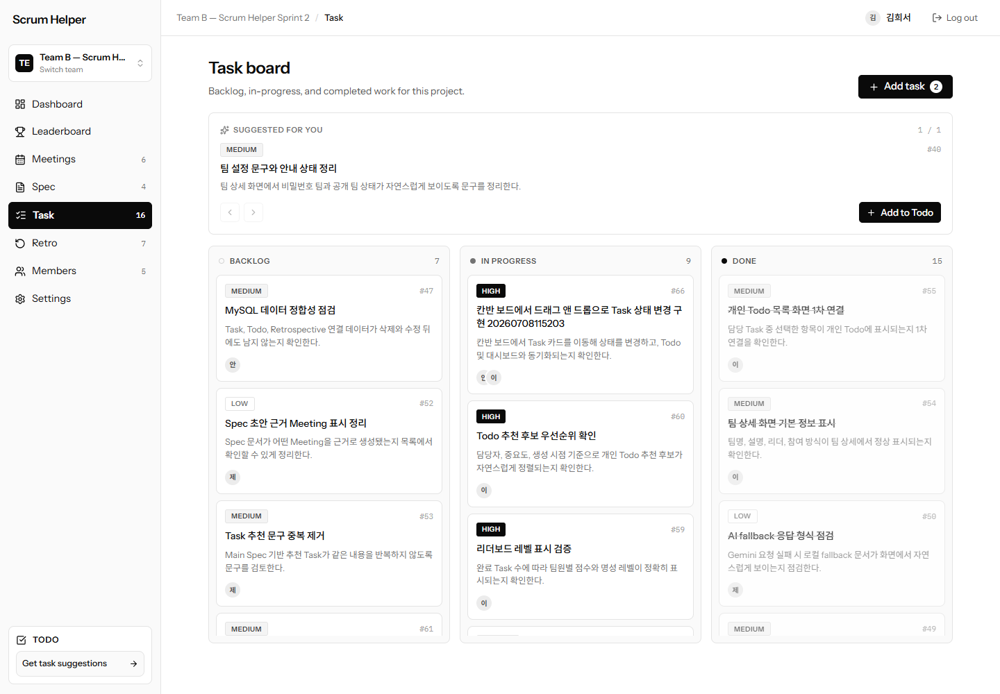
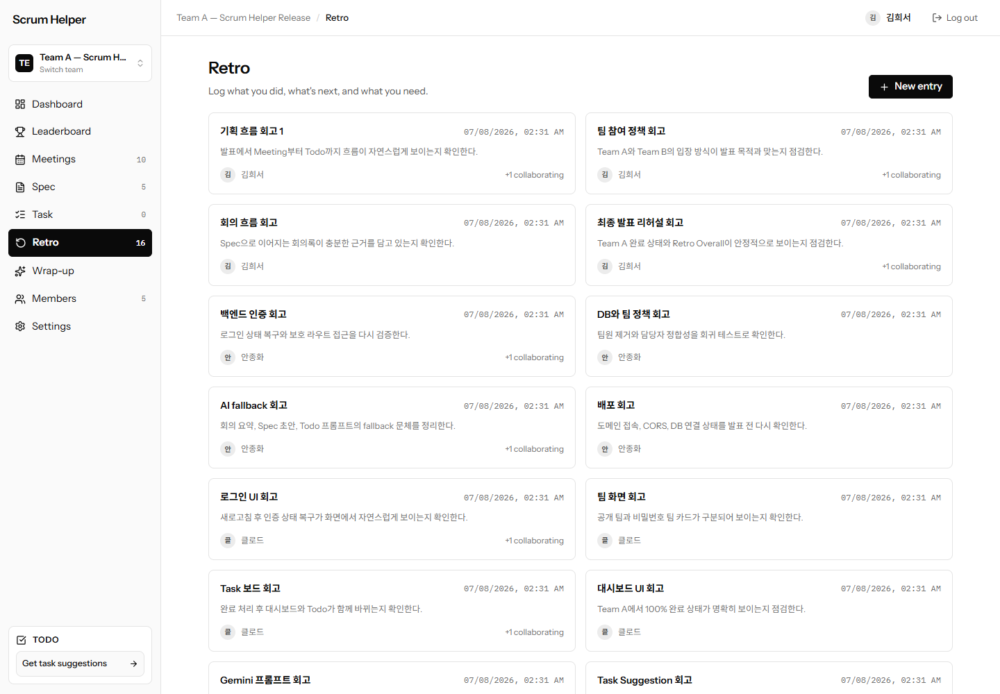

# Scrum Helper

Scrum Helper는 회의에서 나온 아이디어를 Spec, Task, Todo, 회고까지 연결하는 웹 기반 스크럼 관리 서비스입니다.

> 회의는 기록으로 끝나지 않고, 바로 실행 가능한 일로 이어져야 한다.

## Links

| 항목 | 링크 |
|---|---|
| 배포 서비스 | [https://scrumhelper.madcamp-kaist.org](https://scrumhelper.madcamp-kaist.org) |
| GitHub Repository | [https://github.com/madcamp-official/26s-w1-c1-05](https://github.com/madcamp-official/26s-w1-c1-05) |
| 신규 사용자 튜토리얼 | [docs/TUTORIAL.md](docs/TUTORIAL.md) |


## Team

| 이름 | 주요 역할 |
|---|---|
| 안종화 | Backend API, DB schema, JWT/Auth, Gemini API integration, KCloud deployment, demo data |
| 김희서 | Frontend UI/UX, page flow, React implementation, design refinement, user scenario |

## Tech Stack

| 영역 | 기술 |
|---|---|
| Frontend | React, TypeScript, Vite, React Router |
| Backend | Java 17, Spring Boot, Spring Security, Spring Data JPA |
| Database | MySQL |
| AI | Gemini API |
| Deploy | KCloud VM, madcamp-kaist.org subdomain |

## Demo Screens











## Core Flow

```text
Meeting -> Spec Document -> Task -> Personal Todo -> Completion -> Dashboard -> Retrospective
```

Scrum Helper는 소규모 팀이 회의, 스펙 정리, 작업 분배, 개인 Todo, 진행률 확인, 회고를 한 서비스 안에서 처리하도록 돕습니다.

처음 사용하신다면 회원가입부터 프로젝트 마무리(Wrap-up)까지 단계별로 따라갈 수 있는 [신규 사용자 튜토리얼](docs/TUTORIAL.md)을 먼저 읽어보세요.

## Main Features

| 영역 | 기능 |
|---|---|
| Auth | 이메일/비밀번호 회원가입, 로그인, JWT 인증, 내 정보 조회 |
| Team | 전체 팀 목록, 공개 팀 가입, 비밀번호 팀 가입, 초대코드 가입, 팀 생성, 팀장 변경, 팀원 관리 |
| Dashboard | 팀 진행률, 활성 Task, 완료 Task, 팀원/회고 요약, 성장 나무, 프로젝트 완료 Wrap-up |
| Meeting | 회의록 작성/수정/삭제, 녹음 파일 업로드 기반 script 변환, 회의 요약 생성 |
| Spec | 회의록 다중 선택 기반 스펙 문서 초안 생성, Main Spec 지정, 스펙 기반 Task 추천 |
| Task | Kanban 보드, 중요도/담당자 관리, 댓글, 상태 변경, Task 추천 수락 |
| Todo | 내가 담당자인 Task 관리, 추천 Task 3개 표시, Add All, 선택 Todo 기반 실행 프롬프트 생성 |
| Retrospective | 어제 한 일, 오늘 할 일, 궁금한/필요한/알아낸 것 기록, 공동 작업자 권한 관리 |
| Gamification | 완료 Task 기반 리더보드, 명성 레벨, 성장 나무 |

## Page Guide

| 화면 | 설명 |
|---|---|
| `/login`, `/signup` | 사용자 인증 |
| `/teams` | 모든 팀 목록, 팀 생성, 팀 가입 |
| `/teams/:teamId` | 팀 대시보드 |
| `/teams/:teamId/meetings` | 회의록 목록과 회의 생성 |
| `/teams/:teamId/spec-documents` | 스펙 문서 목록, AI 초안 생성, Task 추천 |
| `/teams/:teamId/tasks` | Task 보드, 담당자/중요도/상태 관리 |
| `/teams/:teamId/todos` | 개인 Todo, AI 실행 프롬프트 생성 |
| `/teams/:teamId/retrospectives` | 팀 회고록 |
| `/teams/:teamId/leaderboard` | 완료 Task 기반 랭킹 |
| `/teams/:teamId/wrapup` | 완료 프로젝트 요약 |
| `/teams/:teamId/members`, `/settings` | 팀원/팀 설정 관리 |

## Local Run

자세한 로컬 실행 방법은 [docs/RUNBOOK.md](docs/RUNBOOK.md)를 확인하세요.

Gemini 기반 기능을 사용하려면 백엔드 실행 전에 `GEMINI_API_KEY` 또는 `GOOGLE_API_KEY` 환경변수를 설정합니다. 키가 없거나 호출에 실패하면 서비스 흐름이 끊기지 않도록 local fallback 결과를 반환합니다.

## Documentation

| 산출물 | 문서 |
|---|---|
| 신규 사용자 튜토리얼 | [docs/TUTORIAL.md](docs/TUTORIAL.md) |
| 기획안/기능 명세서 | [docs/submission/WEEK1_PRODUCT_SPEC.md](docs/submission/WEEK1_PRODUCT_SPEC.md) |
| IA 및 화면 설계서 | [docs/submission/WEEK1_IA_SCREEN_SPEC.md](docs/submission/WEEK1_IA_SCREEN_SPEC.md) |
| DB 스키마 | [docs/submission/WEEK1_DB_SCHEMA.md](docs/submission/WEEK1_DB_SCHEMA.md) |
| API 문서 | [docs/submission/WEEK1_API_SPEC.md](docs/submission/WEEK1_API_SPEC.md) |
| 배포/실행 문서 | [docs/RUNBOOK.md](docs/RUNBOOK.md) |
| 테스트 결과 | [docs/TEST_RESULTS.md](docs/TEST_RESULTS.md) |
| 발표 스크립트 | [docs/DEMO_PRESENTATION_SCRIPT.md](docs/DEMO_PRESENTATION_SCRIPT.md) |
| 회고 문서 | [docs/submission/RETROSPECTIVE.md](docs/submission/RETROSPECTIVE.md) |
| Notion 작성 초안 | [docs/submission/NOTION_PAGE_DRAFT.md](docs/submission/NOTION_PAGE_DRAFT.md) |
| Notion 쇼케이스 초안 | [docs/submission/NOTION_SHOWCASE_PAGE.md](docs/submission/NOTION_SHOWCASE_PAGE.md) |

## Verification

- Backend unit/service tests: PASS
- Frontend production build: PASS
- Deployed API demo flow: PASS
- Browser smoke test on deployed service: PASS
- Demo screenshots: prepared under `docs/assets/demo/`
