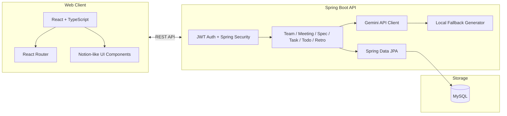

# Notion Showcase Page

이 문서는 MADCADE 페이지 구조를 참고한 Scrum Helper 산출물 페이지용 Notion 본문이다.

사용 방법:

1. Notion 페이지 제목을 `Scrum Helper`로 설정한다.
2. 페이지 아이콘은 `🌱` 또는 `🧭`를 사용한다.
3. 커버 이미지는 아래 URL을 사용한다.
4. `본문 복붙용` 아래 내용만 Notion 본문에 붙여넣는다.

## Cover Image

```text
https://raw.githubusercontent.com/madcamp-official/26s-w1-c1-05/main/docs/assets/demo/scrum-helper-showcase-cover.png
```

## Asset URLs

```text
https://raw.githubusercontent.com/madcamp-official/26s-w1-c1-05/main/docs/assets/demo/scrum-helper-walkthrough.gif
https://raw.githubusercontent.com/madcamp-official/26s-w1-c1-05/main/docs/assets/demo/01-team-a-dashboard.png
https://raw.githubusercontent.com/madcamp-official/26s-w1-c1-05/main/docs/assets/demo/02-team-a-wrapup.png
https://raw.githubusercontent.com/madcamp-official/26s-w1-c1-05/main/docs/assets/demo/03-team-b-todo.png
https://raw.githubusercontent.com/madcamp-official/26s-w1-c1-05/main/docs/assets/demo/04-team-b-task-board.png
https://raw.githubusercontent.com/madcamp-official/26s-w1-c1-05/main/docs/assets/demo/05-team-a-retro.png
```

## Notion 속성 입력값

| 속성 | 값 |
|---|---|
| 프로젝트명 | Scrum Helper |
| 팀명 | Team 5 |
| 팀원 | 안종화, 김희서 |
| 주차 | 1주차 |
| 과제 | 공통과제 I: 웹 기반 프로젝트 |
| GitHub | https://github.com/madcamp-official/26s-w1-c1-05 |
| 배포 링크 | https://anjonghwa.madcamp-kaist.org |
| 기술 스택 | React, TypeScript, Vite, Java 17, Spring Boot, Spring Data JPA, MySQL, JWT, Gemini API, KCloud |
| 한 줄 소개 | 회의에서 나온 내용을 Spec, Task, Todo, 회고까지 연결하는 웹 기반 스크럼 관리 서비스 |

---

# 본문 복붙용

# 🌱 Scrum Helper : Meeting-to-Todo Scrum Flow {color="green_bg"}

> Live Demo : [https://anjonghwa.madcamp-kaist.org](https://anjonghwa.madcamp-kaist.org)

---

## 👬 팀원 소개

<columns>
	<column>
		<callout icon="🧭" color="green_bg">
			<span color="green">**안종화**</span>
			Backend API / DB / Auth / Gemini API / KCloud Deploy / Demo Data
		</callout>
	</column>
	<column>
		<callout icon="🎨" color="blue_bg">
			<span color="blue">**김희서**</span>
			Frontend UI/UX / React Pages / User Flow / Design Refinement
		</callout>
	</column>
</columns>

## 📖 프로젝트 소개

> <span color="green">***Meetings should become executable work.***</span><br>
> 회의에서 나온 아이디어를 Spec, Task, Todo, 회고까지 연결하는 웹 기반 스크럼 관리 서비스

Scrum Helper는 소규모 팀 프로젝트에서 회의록, 스펙 문서, Task, 개인 Todo, 회고가 흩어지는 문제를 해결하기 위해 만들었습니다.

회의에서 나온 내용은 Meeting으로 기록하고, 선택한 Meeting을 기반으로 Spec 초안을 만들고, Spec에서 실행 가능한 Task를 구체화합니다. 이후 각 팀원은 오늘 집중할 작업만 Todo로 가져오고, 프로젝트가 끝나면 Wrap-up과 회고로 팀의 경험을 정리합니다.

### 🎯 기획 의도

팀 프로젝트에서는 실제로 중요한 결정이 회의 중에 많이 나옵니다. 하지만 회의록, 스펙 문서, 할 일 목록, 개인 메모, 회고가 서로 다른 곳에 흩어지면 구현 과정에서 맥락이 사라집니다.

Scrum Helper는 다음 흐름을 하나의 서비스 안에 묶는 것을 목표로 했습니다.

```text
Meeting -> Spec Document -> Task -> Personal Todo -> Completion -> Wrap-up & Retrospective
```

### ✨ 주요 기능

<table header-row="true">
<tr>
<td>기능</td>
<td>설명</td>
</tr>
<tr>
<td>**팀 생성/가입**</td>
<td>공개 팀, 비밀번호 팀, 초대코드 가입을 모두 지원합니다.</td>
</tr>
<tr>
<td>**회의록 관리**</td>
<td>회의록을 작성하고, 녹음 파일을 script로 변환하고, 요약을 생성할 수 있습니다.</td>
</tr>
<tr>
<td>**Spec 초안 생성**</td>
<td>선택한 회의록만 근거로 Gemini 기반 Spec 문서 초안을 만듭니다.</td>
</tr>
<tr>
<td>**Task Board**</td>
<td>Backlog, In Progress, Completed 상태로 Task를 관리하고 담당자와 중요도를 지정합니다.</td>
</tr>
<tr>
<td>**Personal Todo**</td>
<td>내가 오늘 집중할 Task를 Todo로 가져오고, 선택된 Todo를 끝내기 위한 작업 프롬프트를 생성합니다.</td>
</tr>
<tr>
<td>**Retrospective**</td>
<td>어제 한 일, 오늘 할 일, 궁금한/필요한/알아낸 것을 회고록으로 남기고 공동 작업자를 지정합니다.</td>
</tr>
<tr>
<td>**Leaderboard & Growth Tree**</td>
<td>완료 Task 수 기반 리더보드와 성장 나무로 팀의 진행 상황을 시각화합니다.</td>
</tr>
</table>

---

## 🏗️ 시스템 아키텍처



## ⭐ Main Features {color="yellow_bg"}

## **1️⃣ Meeting-to-Task Workflow**

---

<columns>
	<column>
		### **📝 회의록 기반 작업 흐름**
		- 회의 내용을 Meeting으로 기록합니다.
		- 녹음 파일을 업로드하면 script 변환 결과를 받을 수 있습니다.
		- Meeting은 Spec 문서 생성의 근거가 됩니다.
	</column>
	<column>
		### **📄 Spec 기반 Task 추천**
		- 선택한 회의록만 바탕으로 Spec 초안을 생성합니다.
		- Spec 문서에서 Task 후보를 추천받습니다.
		- 추천 Task는 담당자를 지정한 뒤 실제 Task로 수락합니다.
	</column>
</columns>

## **2️⃣ Scrum Execution**

---

<columns>
	<column>
		### **✅ Personal Todo**
		- 팀 전체 Task 중 오늘 집중할 작업만 Todo로 가져옵니다.
		- Todo 추가 시 Task는 In Progress로 이동합니다.
		- Done 처리 시 Todo에서 자동 제거됩니다.
	</column>
	<column>
		### **💬 Context Collaboration**
		- Task 상세에서 댓글로 진행 맥락을 남깁니다.
		- 담당자 변경과 상태 변경으로 업무 분배를 조정합니다.
		- Leaderboard와 Growth Tree로 팀의 현재 상태를 빠르게 파악합니다.
	</column>
</columns>

## 💡 Core Workflow {color="yellow_bg"}

### 1. Meeting Capture

- 회의록을 직접 작성하거나 녹음 파일을 업로드합니다.
- 회의 원문과 요약은 이후 Spec 생성의 입력으로 사용됩니다.

### 2. Spec Draft Generation

- 사용자가 선택한 회의록만 근거로 Spec 초안을 만듭니다.
- Gemini API가 실패하면 local fallback으로 흐름이 끊기지 않게 처리합니다.

### 3. Task & Todo Execution

- Spec 기반 추천 Task를 수락하고 담당자를 지정합니다.
- 개인 Todo에서 오늘 처리할 Task를 선택하고 Generate prompt로 실행 계획을 생성합니다.

### 4. Wrap-up & Retrospective

- 완료 Task, 회의록, 회고 수를 Wrap-up 화면에서 확인합니다.
- 회고록은 KPT형 기록으로 남기며, 공동 작업자 권한을 별도로 관리합니다.

---

## 📱 User Interface {color="green_bg"}

### 🎞️ Demo Flow {color="gray_bg"}


### 1. Dashboard {color="gray_bg"}


- 완료된 프로젝트의 진행률과 팀 상태를 한눈에 확인합니다.
- Growth Tree와 Wrap-up 진입을 통해 프로젝트 마무리 흐름을 보여줍니다.

### 2. Todo {color="gray_bg"}


- 내가 담당자인 Task 중 오늘 집중할 항목만 관리합니다.
- Generate prompt로 바로 실행 가능한 작업 브리프를 생성합니다.

### 3. Task Board {color="gray_bg"}


- Backlog, In Progress, Completed 상태로 Task를 관리합니다.
- 중요도, 담당자, 댓글, 상태 변경을 통해 협업 맥락을 유지합니다.

### 4. Retrospective {color="gray_bg"}


- 어제 한 일, 오늘 할 일, 궁금한/필요한/알아낸 것을 기록합니다.
- 공동 작업자는 회고 본문을 함께 수정할 수 있습니다.

### 5. Wrap-up {color="gray_bg"}


- 프로젝트가 끝난 뒤 완료 Task, 회의록, 회고록을 요약합니다.
- 발표와 부스 시연에서 완료된 프로젝트의 성과를 빠르게 보여줄 수 있습니다.

---

## 🧪 Demo Scenario {color="blue_bg"}

<columns>
	<column>
		<callout icon="1️⃣" color="blue_bg">
			**Cold Start**
			회원가입 -> 팀 생성 -> 회의록 작성 -> Spec 초안 생성 -> Task 생성
		</callout>
	</column>
	<column>
		<callout icon="2️⃣" color="purple_bg">
			**Active Sprint**
			비밀번호 팀 가입 -> Todo 확인 -> Generate prompt -> Task 댓글/담당자 변경
		</callout>
	</column>
	<column>
		<callout icon="3️⃣" color="green_bg">
			**Project Wrap-up**
			초대코드 가입 -> 100% Dashboard -> Wrap-up -> Retrospective
		</callout>
	</column>
</columns>

## 🛠️ Tech Stack {color="blue_bg"}

<table header-row="true">
<tr>
<td>Layer</td>
<td>Stack</td>
</tr>
<tr>
<td>Frontend</td>
<td>React, TypeScript, Vite, React Router</td>
</tr>
<tr>
<td>Backend</td>
<td>Java 17, Spring Boot, Spring Security, Spring Data JPA</td>
</tr>
<tr>
<td>Database</td>
<td>MySQL</td>
</tr>
<tr>
<td>Auth</td>
<td>JWT, BCrypt</td>
</tr>
<tr>
<td>AI</td>
<td>Gemini API, Local Fallback</td>
</tr>
<tr>
<td>Deploy</td>
<td>KCloud VM, madcamp-kaist.org subdomain</td>
</tr>
</table>

## 🔐 Technical Decisions {color="purple_bg"}

<columns>
	<column>
		### **AI Fallback**
		- Gemini API 키가 없거나 호출에 실패해도 서비스 흐름이 끊기지 않습니다.
		- 회의록 요약, Spec 생성, Todo prompt는 local fallback을 제공합니다.
	</column>
	<column>
		### **Permission Policy**
		- 팀장은 한 명만 존재합니다.
		- 댓글 수정/삭제는 작성자만 가능합니다.
		- 회고록 공동 작업자 목록 변경은 작성자만 가능합니다.
	</column>
</columns>

<columns>
	<column>
		### **Todo State Sync**
		- Todo에 Task를 추가하면 In Progress로 이동합니다.
		- Task가 Done이면 Todo에서 자동 제거됩니다.
	</column>
	<column>
		### **Demo Baseline**
		- Team A는 완료 프로젝트입니다.
		- Team B는 진행 중 프로젝트입니다.
		- 발표 전 DB reset으로 같은 상태에서 시연합니다.
	</column>
</columns>

## 📦 Deliverables {color="gray_bg"}

| 산출물 | 위치 |
|---|---|
| 기획안/기능 명세서 | `docs/submission/WEEK1_PRODUCT_SPEC.md` |
| IA 및 화면 설계서 | `docs/submission/WEEK1_IA_SCREEN_SPEC.md` |
| DB 스키마 | `docs/submission/WEEK1_DB_SCHEMA.md` |
| API 문서 | `docs/submission/WEEK1_API_SPEC.md` |
| 배포/실행 문서 | `docs/RUNBOOK.md` |
| 테스트 결과 | `docs/TEST_RESULTS.md` |
| 회고 문서 | `docs/submission/RETROSPECTIVE.md` |

## 🔗 Links

| Type | URL |
|---|---|
| Live Demo | https://anjonghwa.madcamp-kaist.org |
| GitHub | https://github.com/madcamp-official/26s-w1-c1-05 |
| README | https://github.com/madcamp-official/26s-w1-c1-05/blob/main/README.md |

---

## 🤝 느낀 점 {color="gray_bg"}

<columns>
	<column>
		🧭 안종화
		- API 명세와 DB 스키마가 먼저 정리되어야 merge 이후에도 기준을 잃지 않는다는 점을 배웠습니다.
		- AI 기능은 성공 케이스보다 실패 케이스의 UX를 먼저 설계해야 실제 서비스처럼 보인다는 점을 확인했습니다.
		- 배포 환경에서는 DB 초기화, API key, domain, restart 흐름을 문서화하는 것이 중요했습니다.
	</column>
	<column>
		🎨 김희서
		- 사용자가 발표와 부스 시연에서 바로 이해할 수 있도록 화면 흐름을 설계하는 것이 중요했습니다.
		- Task, Todo, 회고가 분리되지 않고 하나의 흐름으로 보이도록 UI를 구성하는 과정이 핵심이었습니다.
		- 기능이 많아질수록 화면 밀도와 정보 구조를 정리하는 일이 중요했습니다.
	</column>
</columns>
