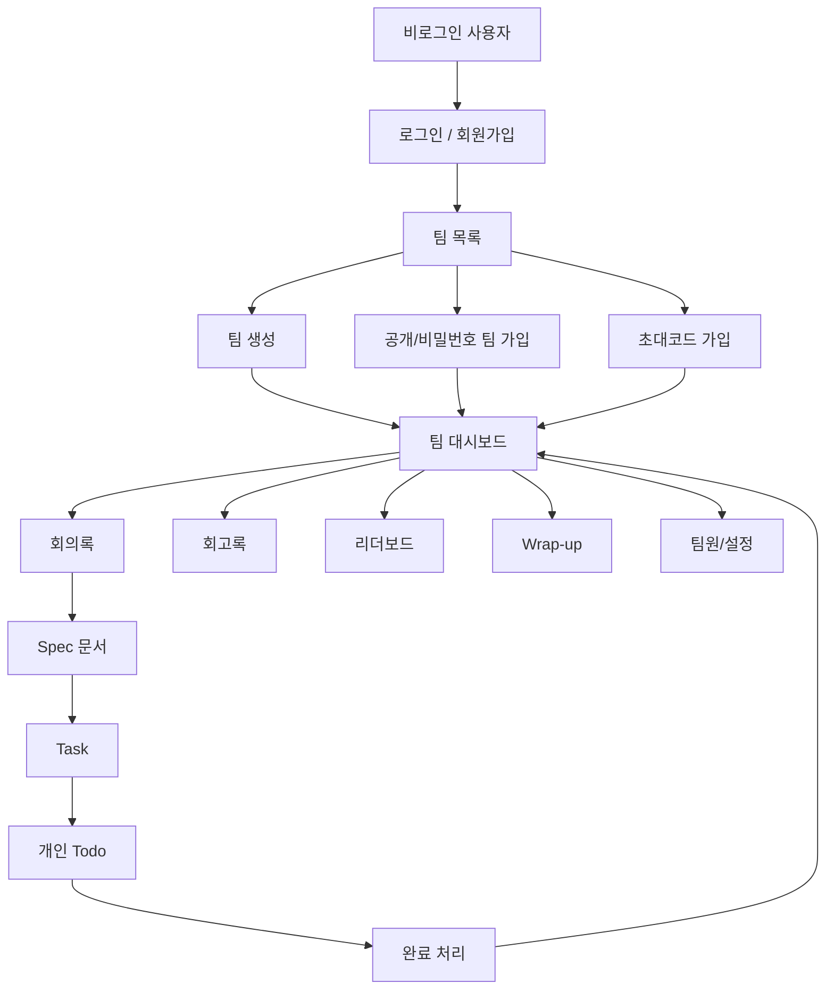

# Scrum Helper IA & Screen Spec

## 1. IA 요약



## 2. 라우트 구조

| Route | 화면 | 주요 기능 |
|---|---|---|
| `/login` | 로그인 | 이메일/비밀번호 로그인 |
| `/signup` | 회원가입 | 이름/이메일/비밀번호 가입 |
| `/teams` | 팀 목록 | 전체 팀 조회, 팀 생성, 공개/비밀번호/초대코드 가입 |
| `/teams/:teamId` | 팀 대시보드 | 진행률, KPI, 성장 나무, 최근 상태 |
| `/teams/:teamId/meetings` | 회의록 | 회의록 작성, 녹음 파일 script 변환, 요약 생성 |
| `/teams/:teamId/spec-documents` | Spec | 회의록 기반 Spec 초안 생성, Main Spec, Task 추천 |
| `/teams/:teamId/tasks` | Task | Kanban 보드, Task 생성/수정/삭제, 댓글, 담당자 관리 |
| `/teams/:teamId/todos` | Todo | 내 담당 Task, 추천 Task, AI 실행 프롬프트 |
| `/teams/:teamId/retrospectives` | 회고 | KPT형 회고 작성, 공동 작업자 관리 |
| `/teams/:teamId/leaderboard` | 리더보드 | 완료 Task 수, 순위, 명성 레벨 |
| `/teams/:teamId/wrapup` | Wrap-up | 완료 프로젝트 성과 요약 |
| `/teams/:teamId/members` | 팀원 관리 | 팀원 목록, 팀장 변경, 팀원 제거 |
| `/teams/:teamId/settings` | 팀 설정 | 팀 정보 수정, 비밀번호 변경, 초대코드 재발급 |

## 3. 주요 화면 설계

### 3.1 팀 목록

```text
[Scrum Helper]                         [프로필/로그아웃]

Teams
[검색 입력] [초대코드 입력] [Create team]

┌ Team Card ┐  ┌ Team Card ┐  ┌ Team Card ┐
│ 팀 이름   │  │ 팀 이름   │  │ 팀 이름   │
│ 공개/잠금 │  │ 공개/잠금 │  │ 공개/잠금 │
│ 팀장/인원 │  │ 팀장/인원 │  │ 팀장/인원 │
│ [입장/가입]│ │ [비밀번호]│ │ [입장]    │
└───────────┘  └───────────┘  └───────────┘
```

### 3.2 팀 대시보드

```text
[Sidebar]  Dashboard
           Good afternoon, 사용자

           [Active Tasks] [Completed] [Team Progress]

           ┌ Growth Tree / Progress ┐    ┌ Quick Actions ┐
           │ 완료율, 성장 시각화     │    │ 주요 이동      │
           └────────────────────────┘    └───────────────┘

           [Recent Tasks] [Recent Retrospectives] [Quick Actions]
```

### 3.3 회의록

```text
Meetings
[New meeting] [Upload audio]

왼쪽: 회의록 목록
오른쪽: 선택한 회의록 상세

- 제목
- 회의 일시
- raw transcript
- summary
- [Generate summary]
- [Create spec from selected meetings]
```

### 3.4 Spec 문서

```text
Spec Documents
[Generate draft from meetings] [New spec]

왼쪽: 문서 목록
가운데: Markdown 문서 본문
오른쪽: Suggested tasks

Suggested task card
- 제목
- 설명
- 중요도
- 담당자 선택
- [Accept]
```

### 3.5 Task

```text
Task Board
[Add task]

┌ Backlog ┐   ┌ In Progress ┐   ┌ Completed ┐
│ Card    │   │ Card        │   │ Card      │
│ priority│   │ priority    │   │ priority  │
│ assignee│   │ assignee    │   │ assignee  │
└─────────┘   └─────────────┘   └───────────┘

Task Detail
- 제목
- 설명
- 중요도
- 담당자
- 댓글 thread
```

### 3.6 Todo

```text
My Todo
[Generate prompt]

Todo list
[ ] Task A
[ ] Task B
[ ] Task C

Suggested Tasks
- 중요도 높음 우선
- 중요도가 같으면 오래된 Task 우선
- Todo가 5개 이상이면 추천하지 않음
- [Add to Todo] [Add All]

Generated prompt
- 목표
- 완료 기준
- 실행 단계
- 확인 질문
```

### 3.7 회고록

```text
Retrospectives
[New retrospective]

List
- 제목
- 작성자
- 공동 작업자
- 수정일

Detail
- 어제 한 일
- 오늘 할 일
- 궁금한/필요한/알아낸 것
- 공동 작업자
```

### 3.8 Wrap-up

```text
That's a wrap

[Total Tasks] [Meetings] [Retrospectives] [Members]

Progress 100%
Member contribution
Completed task list
Retrospective highlights
```

## 4. 화면 간 사용자 흐름

| 흐름 | 단계 |
|---|---|
| 첫 사용 | 회원가입 -> 팀 생성 -> 팀 대시보드 |
| 기존 팀 합류 | 로그인 -> 팀 목록 -> 비밀번호/초대코드 가입 -> 팀 대시보드 |
| 회의 기반 작업 생성 | 회의록 작성 -> Spec 초안 생성 -> Spec 저장 -> Task 추천 -> 담당자 배정 |
| 개인 작업 수행 | Todo 이동 -> Generate prompt -> 작업 수행 -> Done 처리 |
| 프로젝트 마무리 | 대시보드 -> Wrap-up -> 회고록 작성 -> 리더보드 확인 |

## 5. 공통 UI 상태

| 상태 | 처리 |
|---|---|
| 로딩 | skeleton 또는 loading state |
| 빈 목록 | Empty state와 주요 생성 버튼 |
| 권한 없음 | 오류 메시지 후 안전한 화면으로 이동 |
| 저장 실패 | form 하단 또는 toast로 오류 표시 |
| AI 실패 | local fallback 결과 표시 |
| 완료 프로젝트 | Wrap-up 중심으로 성과 요약 표시 |
